<picture>
  <source media="(prefers-color-scheme: dark)" srcset="./dark.svg">
  <source media="(prefers-color-scheme: light)" srcset="./light.svg">
  
</picture>

## The point of view

> Shipping working, end-to-end applications — not isolated exercises.

- 📍 Based in **Delhi**
- 🎓 3rd-year B.Tech (IT), GGSIPU — cloud computing intern at Codec Technologies

*Comfortable across the stack: API design, database design, auth, and debugging.*

## What I'm shipping

  

## Live stats

> Repos, stars, followers, and contribution streak are pulled live from the GitHub API on every page load — nothing here is typed in.

## Featured Projects

<picture>
  <source media="(prefers-color-scheme: dark)" srcset="./projects-dark.svg">
  <source media="(prefers-color-scheme: light)" srcset="./projects-light.svg">
  
</picture>

## Stack

<picture>
  <source media="(prefers-color-scheme: dark)" srcset="./stack-dark.svg">
  <source media="(prefers-color-scheme: light)" srcset="./stack-light.svg">
  
</picture>

## Start a conversation

  

